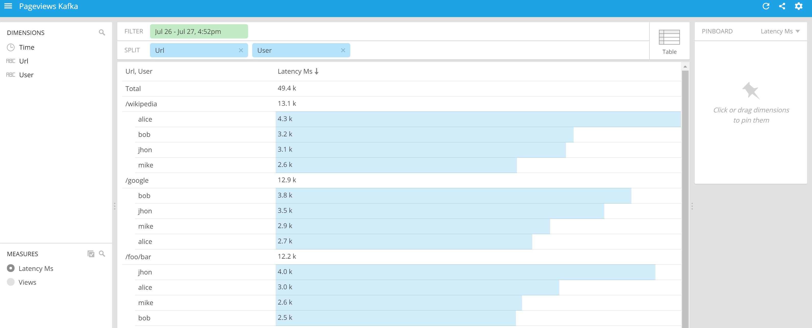

## **From Kafka to Druid on MapR**

### Overview

This is an example of how you can ingest time series data into the Druid database using Kafka.
A Kakfa producer will push JSON messages on a specific topic that will be ingested into the Druid databases using the Tranquility service that comes with Druid.
A easy way to acquire almost all the needed setup is to install a sandbox that has many of needed services (like hortonworks, mapr, cloudera). 

### Components
#### Druid
Currently Druid is not available on the mentioned sandbox, but you can refer to [Druid Documentation](http://druid.io/docs/0.9.0/tutorials/quickstart.html) for installing it.
It would be better to configure Druid on the sandbox, because Druid needs Zookeeper service to be present for nodes synchronization.
The next steps assume that druid is present on a mapr sandbox and properly configured.
On the mapr sandbox the Zookeeper port is 5181. To start Druid you must configure zookeeper port in :
```shell
config/_common/common.runtime.properties
``` 
located in the directory where Druid is installed.
Take a look on the configuration files for each of the Druid services and ensure the sandbox have enough memory to start all the services
Go to [http://maprdemo:8081/#/](http://maprdemo:8081/#/) to see if Druid is started, where maprdemo is the host name for the machine where Druid is installed.
    
####Kafka broker
Start Kafka broker by executing the command: 
```shell
./bin/kafka-server-start.sh /config/server.properties
```
This will start the Kafka server on port 9082. Look on the console if Kakfa was started.
Create a Kafka topic for our custom messages: 
```shell
./bin/kafka-topics.sh --create --zookeeper localhost:5181 --replication-factor 1 --partitions 1 --topic pageviews
```
Pageview will be the name for out topic where data coming from outside will be stored. Data that will be send, in form of JSON, will look like this:
```json
{"time": "2016-07-26T15:19:39.304Z", "url": "/foo/bar", "user": "user1", "latencyMs": 32}
```
    
    
####Tranquility Server
Tranquility will take our JSON messages from the Kafka topic, parse it and put it into the Druid database.
Make sure that Tranquility is installed on configured on the mapr machine. If not please refer to [Tranquility](https://github.com/druid-io/tranquility) for this.
From _conf-quickstart/tranquility_ within druid installation modify the _kafka.json_ file to your needs, based on the JSON message that we want to ingest.
The most important keys are : _datasource, timestampSpec, dimensionsSpec, metricsSpec_ and the _properties_ section for Kafka topic and Zookeeper 

```json
{
     "dataSources" : {
       "pageviews-kafka" : {
         "spec" : {
           "dataSchema" : {
             "dataSource" : "pageviews-kafka",
             "parser" : {
               "type" : "string",
               "parseSpec" : {
                 "timestampSpec" : {
                   "column" : "time",
                   "format" : "auto"
                 },
                 "dimensionsSpec" : {
                   "dimensions" : ["url", "user"],
                   "dimensionExclusions" : [
                     "timestamp",
                     "value"
                   ]
                 },
                 "format" : "json"
               }
             },
             "granularitySpec" : {
               "type" : "uniform",
               "segmentGranularity" : "hour",
               "queryGranularity" : "none"
             },
             "metricsSpec" : [
               {
                 "name" : "views",
                 "type" : "count", 
               },
               {
                 "fieldName" : "latencyMs",
                 "name" : "latencyMs",
                 "type" : "doubleSum"
               }
             ]
           },
           "ioConfig" : {
             "type" : "realtime"
           },
           "tuningConfig" : {
             "type" : "realtime",
             "maxRowsInMemory" : "100000",
             "intermediatePersistPeriod" : "PT10M",
             "windowPeriod" : "PT10M"
           }
         },
         "properties" : {
           "task.partitions" : "1",
           "task.replicants" : "1",
           "topicPattern" : "pageviews"
         }
       }
     },
     "properties" : {
       "zookeeper.connect" : "localhost:5181",
       "druid.discovery.curator.path" : "/druid/discovery",
       "druid.selectors.indexing.serviceName" : "druid/overlord",
       "commit.periodMillis" : "15000",
       "consumer.numThreads" : "2",
       "kafka.zookeeper.connect" : "localhost:5181",
       "kafka.group.id" : "tranquility-kafka"
     }
   }
```

Then start the tranquility server with the above configuration file.
```
bin/tranquility kafka -configFile ../druid-0.9.1.1/conf-quickstart/tranquility/kafka.json
```
Look for the messages in the console that shows the tranquility was indeed started
```
[KafkaConsumer-1] INFO  c.metamx.emitter.core.LoggingEmitter - Start: started [true]
```
####Ingest messages
Execute _KafkaProduceMain_ class to trigger ingestion of some messages. The first argument of the program is the number of randomly generated messages.
You can execute if from an IDE or using java, after a _mvn clean install_: 
```java
java -jar target\druid-kafka-ingestion-1.0-SNAPSHOT.jar 1000
```

That will send the messages to a Kafka topic from which tranquility will look and store them into Druid
####Query
Querying the server with the following JSON query, that selects the counts grouped by url:
```json
{
  "queryType": "groupBy",
  "dataSource": "pageviews-kafka",
  "dimensions": ["url"],
  "granularity": "all",
  "aggregations": [
    {"type": "count", "name": "latencyMs"}
  ],
  "intervals": [
    "2000-01-01/2020-01-02"
  ],

  "pagingSpec":{"pagingIdentifiers": {}, "threshold":500}
}
```
should receive a JSON response that can look like this:
```json
[ {
  "version" : "v1",
  "timestamp" : "2000-01-01T00:00:00.000Z",
  "event" : {
    "latencyMs" : 333,
    "url" : "/foo/bar"
  }
}, {
  "version" : "v1",
  "timestamp" : "2000-01-01T00:00:00.000Z",
  "event" : {
    "latencyMs" : 188,
    "url" : "/google"
  }
}, {
  "version" : "v1",
  "timestamp" : "2000-01-01T00:00:00.000Z",
  "event" : {
    "latencyMs" : 191,
    "url" : "/wikipedia"
  }
}, {
  "version" : "v1",
  "timestamp" : "2000-01-01T00:00:00.000Z",
  "event" : {
    "latencyMs" : 170,
    "url" : "/yahoo"
  }
} ]
```

Viewing data with a visualization tool, like Pivot you can represent it like in the picture below

